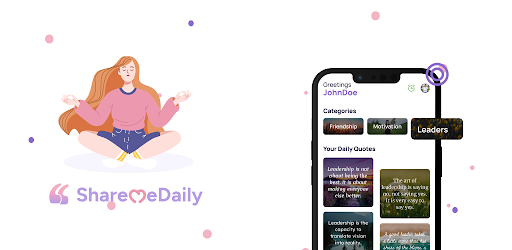

# ShareMeDaily

An open-source Flutter application that delivers daily affirmations and positive quotes to help boost self-esteem, reduce stress, and cultivate mindfulness.



## 📋 Table of Contents

- [Features](#-features)
- [Screenshots](#-screenshots)
- [Architecture](#-architecture)
- [Tech Stack](#-tech-stack)
- [Installation](#-installation)
- [Development Setup](#️-development-setup)
- [Project Structure](#-project-structure)
- [Configuration](#-configuration)
- [Contributing](#-contributing)
- [License](#-license)

## ✨ Features

- 🌞 Daily positive affirmations and quotes
- 🔖 Categorized collections of affirmations
- 📝 Bookmark and share your favorite affirmations
- 🔍 Search functionality for finding specific quotes
- 🎨 Quote customization with editor tools
- 👤 User profiles with preferences
- 🌙 Light and dark themes
- 📱 Responsive design that works across all device sizes

## 📱 Screenshots
<table>
  <tr>
    <td></td>
    <td></td>
    <td></td>
  </tr>
  <tr>
    <td></td>
    <td></td>
    <td></td>
  </tr>
</table>

## 🏛 Architecture

ShareMeDaily follows a provider-based architecture with a clear separation of concerns:

```
┌─────────────────┐     ┌─────────────────┐     ┌─────────────────┐
│      View       │     │    Provider     │     │    Services     │
│    (Screens)    │◄────┤(State Management)◄────┤  (API Services) │
│                 │     │                 │     │                 │
└─────────────────┘     └─────────────────┘     └─────────────────┘
```

- **State Management**: Provider pattern for reactive and efficient state management
- **Screens**: UI components organized by feature
- **Services**: API and data handling services

The app follows a simple and maintainable architecture:
- **Provider**: Manages application state and business logic
- **View**: Handles UI rendering and user interactions
- **Services**: Manages data fetching and external integrations

## 🔧 Tech Stack

- **Frontend**: Flutter 3.29.3
- **State Management**: Provider 6.0.5
- **Local Storage**: Shared Preferences 2.20
- **HTTP Client**: Dio 5.3.0
- **Animations**: Flutter Animation
- **Analytics**: Firebase Analytics
- **Crash Reporting**: Firebase Crashlytics

## 🚀 Installation

### System Requirements
- Flutter 3.29.3 or higher
- Dart 3.7.2 or higher
- Android Studio / VS Code
- Android SDK 23+ or iOS 12+

### Android

<!-- Download the latest APK from [Releases](https://github.com/Evalogical-Inc/sharemedaily/releases) and install it on your device. -->
Download the latest APK from [Releases](https://play.google.com/store/apps/details?id=com.evalogical.sharemedaily&pli=1) and install it on your device.

### iOS

_Coming soon to the App Store_

For TestFlight access:
1. Email your Apple ID to [contact@evalogical.com](mailto:contact@evalogical.com)
2. Accept the TestFlight invitation
3. Download via TestFlight

## 🛠️ Development Setup

### Prerequisites

- [Flutter SDK](https://docs.flutter.dev/get-started/install) (3.29.3+)
- [Git](https://git-scm.com/)
- [Android Studio](https://developer.android.com/studio) or [VS Code](https://code.visualstudio.com/) with Flutter extensions
- Dart SDK 3.7.2+

### Clone and Setup

```bash
# Clone the repository
git clone https://github.com/Evalogical-Inc/sharemedaily.git

# Navigate to project directory
cd sharemedaily

# Install dependencies
flutter pub get

# Create the environment file
cp .env.sample .env

# Setup development environment
flutter run --debug

# Generate necessary files
flutter pub run build_runner build --delete-conflicting-outputs
```

Note: You'll need to configure your `.env` file with development credentials. See the Configuration section below.

### Configuration

1. Create a `.env` file in the project root based on the sample template:

```
# Copy this from .env.sample
API_BASE_URL=https://dev-api.evalogical.com/v1
API_KEY=your_development_api_key  # For contributor testing only

# Optional configurations
ENABLE_ANALYTICS=false
```

2. Install the required packages for environment variable support:

```bash
flutter pub add flutter_dotenv
```

3. Add the `.env` file to your assets in `pubspec.yaml`:

```yaml
assets:
  - .env
  - assets/images/
  - assets/fonts/
```

4. For Firebase integration (optional):
   - Request development Firebase configuration files from maintainers
   - Place `google-services.json` in `android/app/` 
   - Place `GoogleService-Info.plist` in `ios/Runner/`
   
Note: The actual `.env` file should never be committed to the repository. Contributors should create their own based on the template.

### Running the App

```bash
# Debug mode
flutter run

# Profile mode (performance testing)
flutter run --profile

# Release mode
flutter run --release
```

## 📂 Project Structure

```
lib/
├── config/                  # App configuration
│   ├── app_url/             # API endpoint configuration
│   ├── constants/           # App constants and enums
│   ├── font_styles/         # Typography definitions
│   └── SP/                  # SharedPreferences configuration
├── helpers/                 # Helper utilities
├── models/                  # Data models
├── provider/                # Provider state management
├── routes/                  # App navigation routes
├── screens/                 # App screens (Views)
│   ├── home/                # Home screen with widgets
│   ├── favorite/            # Favorites screen
│   ├── feature/             # Feature screens
│   ├── quotes/              # Quote screens
│   ├── category/            # Category screens
│   ├── setting/             # Settings screen
│   ├── search/              # Search functionality
│   ├── theme/               # Theme settings
│   ├── profile/             # User profile
│   └── onboard/             # Onboarding screens
├── services/                # API and external services
│   └── api_services/        # API service implementations
├── theme/                   # App theming
├── utilities/               # Utility functions
└── widgets/                 # Reusable widgets
    ├── appinio_swiper/      # Custom swipe components
    └── custom_editor/       # Text editor components
```


## 🤝 Contributing

1. Fork the repository
2. Create a feature branch (`git checkout -b feature/amazing-feature`)
3. Commit your changes (`git commit -m 'Add some amazing feature'`)
4. Push to the branch (`git push origin feature/amazing-feature`)
5. Open a Pull Request

Please read our [Contributing Guidelines](CONTRIBUTING.md) for more details.

## 📄 License

This project is licensed under the MIT License - see the [LICENSE](LICENSE) file for details.